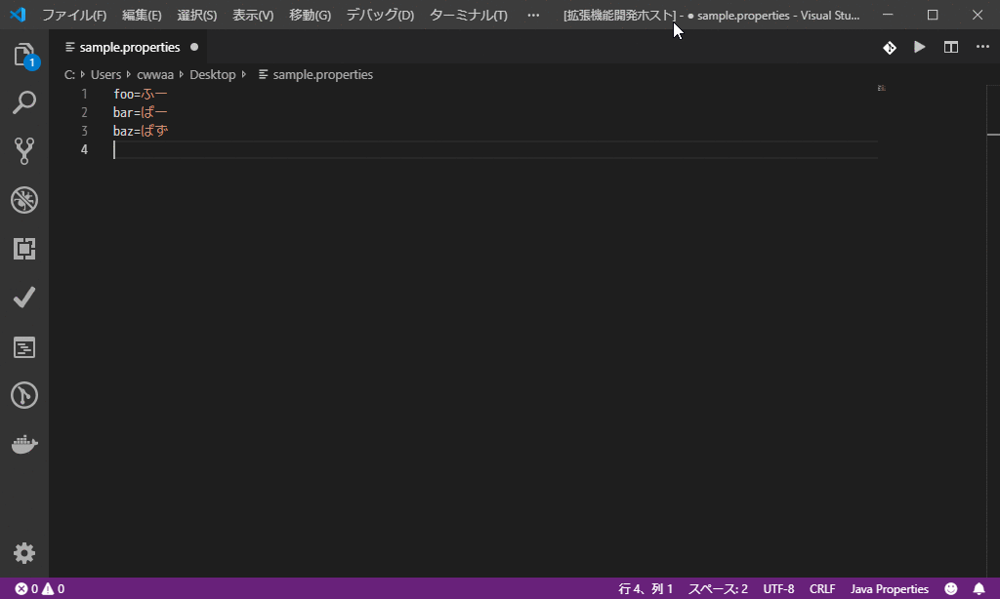

# Native-ASCII Converter README

VS Code extension that converts characters with Unicode escapes or vice versa. The same as ['native2ascii' tool of JDK](https://docs.oracle.com/javase/8/docs/technotes/tools/windows/native2ascii.html).

## Links

* [native-ascii-converter - Visual Studio Marketplace](https://marketplace.visualstudio.com/items?itemName=cwan.native-ascii-converter)
* [日本語ドキュメント](README_ja.md)

## Features

* Commands (manual execution):
    + `Convert characters: Native to Ascii` - Convert all non-ASCII characters in the active text document with Unicode escapes.
    + `Convert characters: Ascii to Native` - Convert all Unicode escapes characters in the active text document with native characters.

* Options:
    + If you activate a text file which extension is '.properties', the command "Ascii to Native" invoked automatically.
    + If you save a text file which extension is '.properties', the command "Native to Ascii" invoked automatically.
    + You can exclude the comment lines (that start with '#') in converting "Native to Ascii".

## Extension Settings

This extension contributes the following settings:

* `native-ascii-converter.letter-case`: Letter case in Unicode characters
    + `"Lower case"` (default)
    + `"Upper case"`
* `native-ascii-converter.comment-conversion`: Unicode conversion of the comment is carried out
    + `true`: carried out (default)
    + `false`: not carried out
* `native-ascii-converter.auto-conversion-on-save`: Convert automatically when the file (*.properties) is saved
    + `true`: effective
    + `false`: ineffective (default)
* `native-ascii-converter.auto-conversion-on-activate`: Convert automatically when the file (*.properties)  is activated
    + `true`: effective
    + `false`: ineffective (default)
