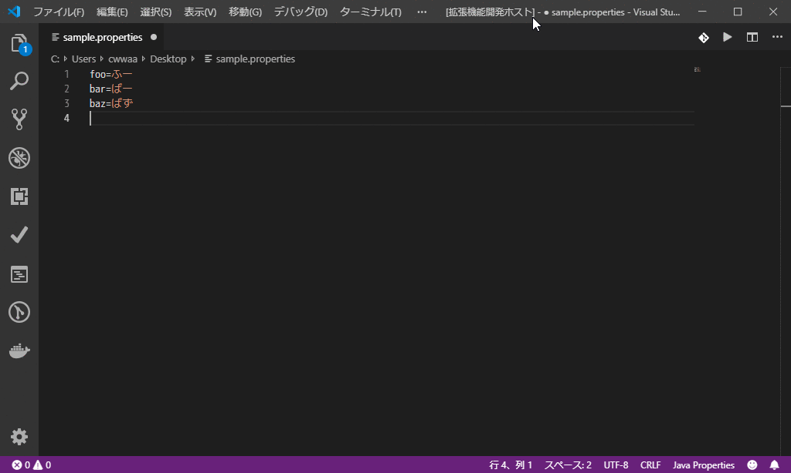

# Native-ASCII Converter README

文字のUnicodeエスケープ変換（または逆変換）を行うVS Code拡張機能です。[JDKの'native2ascii'ツール](https://docs.oracle.com/javase/8/docs/technotes/tools/windows/native2ascii.html)と同様の変換を行います。

## リンク

* [native-ascii-converter - Visual Studio Marketplace](https://marketplace.visualstudio.com/items?itemName=cwan.native-ascii-converter)
* [English document](README.md)

## 機能

* コマンド（マニュアル実行）
    + `Convert characters: Native to Ascii` - アクティブテキストドキュメント内の全ての非ASCII文字をUnicodeエスケープします。
    + `Convert characters: Ascii to Native` - アクティブテキストドキュメント内の全てのUnicodeエスケープ文字を元のネイティブ文字に戻します。

* オプション
    + propertiesファイルがアクティブになったときに、"Ascii to Native"変換を自動的に実行させることができます。
    + propertiesファイルを保存したときに、"Native to Ascii"変換を自動的に実行させることができます。
    + コメント行（'#'で始まる行）で、"Native to Ascii"変換を行わないようにすることができます。



## 拡張機能の設定

この拡張機能には、以下の設定があります。

* `native-ascii-converter.letter-case`: Unicodeエスケープしたときの大文字/小文字
    + `"Lower case"` : 小文字（デフォルト）
    + `"Upper case"`: 大文字
* `native-ascii-converter.comment-conversion`: コメント行の変換を行うかどうか
    + `true`: 変換を行う（デフォルト）
    + `false`: 変換を行わない
* `native-ascii-converter.auto-conversion-on-save`: propertiesファイルを保存したときに自動変換を行うかどうか
    + `true`: 行う
    + `false`: 行わない（デフォルト）
* `native-ascii-converter.auto-conversion-on-activate`: propertiesファイルがアクティブになったときに自動変換を行うかどうか
    + `true`: 行う
    + `false`: 行わない（デフォルト）
* `native-ascii-converter.use-files.associations`: 自動変換のときにsetting.jsonの"files.associations"を適用するかどうか
    + `true`: 適用する
    + `false`: 適用しない。ファイル名が"*.properties"で終わる場合のみ自動変換を行う。（デフォルト）

`native-ascii-converter.use-files.associations`が`true`の場合、settings.jsonが以下のように設定されているとき、名前が`*.properties`または`*.properties.prod`のファイルが自動変換対象となります。

```json
{
  "files.associations": {
    "*.properties": "properties",
    "*.properties.prod": "properties"
  }
}
```
